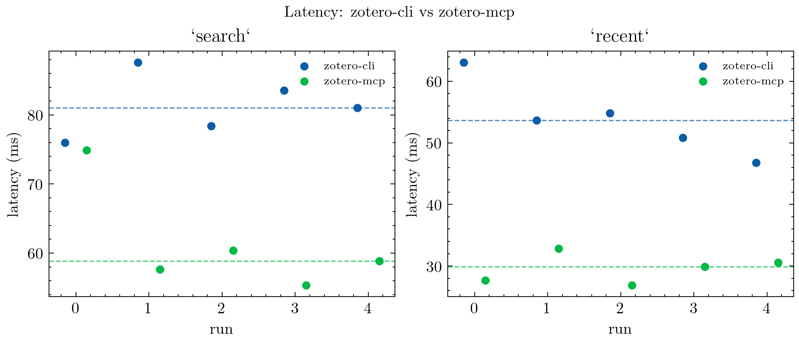
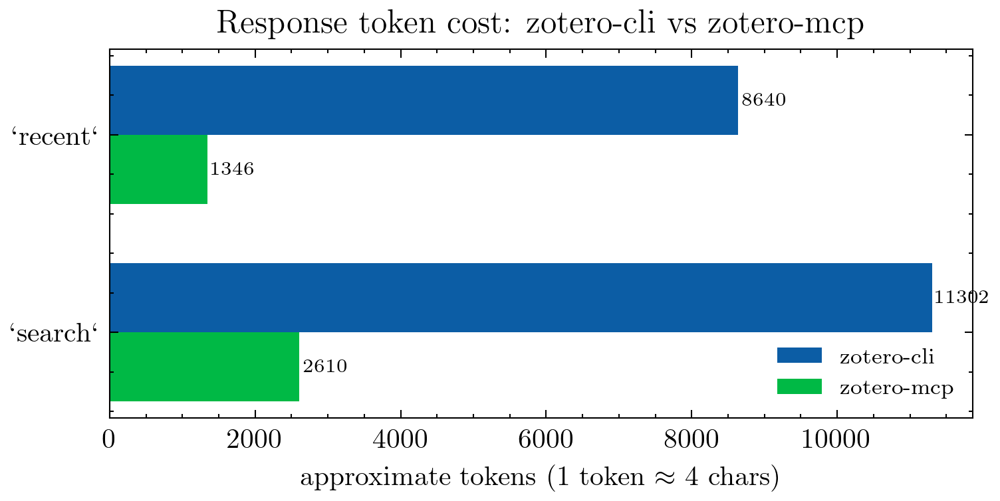

# zotero-cli

Terminal interface for [Zotero](https://www.zotero.org/), mirroring the MCP operations without needing an LLM. Talks to the Zotero local connector API on `localhost:23119`.

## Prerequisites

Zotero must be running. Verify with:

```sh
curl -s http://localhost:23119/connector/ping
# → <!DOCTYPE html><html><body>Zotero is running</body></html>
```

## Install

```sh
cargo install --path .
# installs zotero-cli to ~/.cargo/bin
```

Or just build without installing:

```sh
cargo build --release
# binary at: target/release/zotero-cli
```

## Quick check

```sh
zotero-cli --help
zotero-cli recent 5          # last 5 added items
zotero-cli search "author year"
zotero-cli config            # show current config path and values
```

## Usage

```
zotero-cli [OPTIONS] <COMMAND>

Options:
  --json        Output raw JSON (works on all subcommands)
  --api-base    Override API base URL

Commands:
  search <query> [-l <limit>]   Search items by keyword (default limit: 25)
  get <key>                     Full metadata for an item
  annotations <key>             PDF annotations attached to an item
  notes <key>                   Notes attached to an item
  collections                   List all collections
  collection <id>               List items in a collection
  add doi <doi>                 Add item by DOI
  add url <url>                 Add item by URL
  tags                          List all tags
  recent [n]                    N most recently added items (default: 10)
  config                        Show config file path and active settings
```

## Configuration

Config file: `~/.config/zotero-cli/config.toml`

```toml
api_base     = "http://localhost:23119/api"   # default
api_key      = ""                             # optional, for web API
user_id      = 0                              # optional, for web API
library_type = "user"                         # "user" or "group"
```

Without `user_id` set, all requests go to the local Zotero instance (no API key needed).

## JSON output

Every subcommand supports `--json` for piping:

```sh
zotero-cli search "Agha-mohammadi" --json | jq '.[].data.title'
zotero-cli recent 20 --json | jq '.[].data.key'
```

## zotero-cli vs zotero-mcp

### Benchmark (measured on Linux, Zotero 8, 5-run median)

Run `bench/.venv/bin/python bench/bench.py` to reproduce (see `bench/` for setup).




| Operation | Tool | Latency (ms) | Payload | ~Tokens |
|---|---|---|---|---|
| `search "mppi"` (25 results) | `zotero-cli --json` | 77 ms | 45 210 B | 11 302 |
| | `zotero-mcp` | 54 ms | 10 442 B | 2 610 |
| `recent 10` | `zotero-cli --json` | 47 ms | 34 560 B | 8 640 |
| | `zotero-mcp` | 28 ms | 5 384 B | 1 346 |

**zotero-mcp wins inside Claude Code** — it stays warm as a persistent process
and returns formatted text rather than raw JSON, so it's both faster and cheaper
per call.

**zotero-cli wins everywhere else:**
- Shell scripts, cron jobs, other editors
- No MCP server or Claude Code required
- Pipe through `jq` to cut tokens down to MCP levels:

```sh
! zotero-cli search "mppi" --json | jq '[
  .[] | select(.data.itemType != "attachment") | {
    key: .key,
    title: .data.title,
    authors: [.data.creators[] | select(.creatorType=="author") | .lastName],
    date: .data.date,
    doi: .data.doi,
    tags: [.data.tags[].tag]
  }
]'
```

## Static binary (TODO)

Build a fully static binary with [`cross`](https://github.com/cross-rs/cross):

```sh
cross build --target x86_64-unknown-linux-musl --release
```
